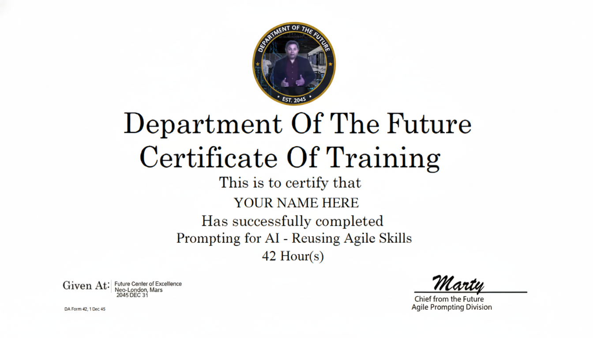

## Prompting for AI - Reusing Agile Skills
**Reuse your Agile skills to get great AI results**

https://github.com/bodyhigh/prompt-architect

1) Prompt basics (LLM, context, tokens)
2) From Agile → prompting (AC, user stories, Gherkin)
3) **Prompt Architect** (Full + Lite)
4) Example executions + tips
5) Q&A + handoff docs

<!--
GOAL: Set expectations & energy. Say this session turns what we already do in Agile into prompting superpowers.
TIME: ~1 min
KEY LINES:
- “You already know how to write great prompts—because you know AC and Gherkin.”
- “We’ll end with copy-paste prompts + a quick practice.”
TRANSITION: “First, a tiny bit of vocabulary so we’re aligned.”
-->

---

## Why this matters (for us)
- Faster drafts, clearer plans, fewer rework loops
- Prompts that mirror our **acceptance criteria** style
- Repeatable quality: same input ⇒ similar output

**Participation Trophies:** You’ll leave with a prompt you can use today.

<!--
TIME: ~1 min
ANGLE: Tie to real pain—rework and inconsistent outputs. Emphasize repeatability.
ASK: “Think of one task this week you’d love to automate a first draft for.”
TRANSITION: “To keep terms straight, 60 seconds of glossary.”
-->

---

## Glossary (newbie-friendly)
- **LLM** — Large Language Model (text predictor)
- **Model** — The specific AI (e.g., GPT-x)
- **Context** — Info you give the model (task, constraints, inputs)
- **Tokens** — Word pieces; affect length/cost
- **Hallucination** — Confident wrong answer
- **Guardrails** — Rules that keep outputs safe/usable (e.g., exclude PII/PHI; CUI markings)

<!--
TIME: ~2 min
NOTES: Keep it plain. Use “predicts next chunk of text” analogy.
TIP: Guardrails are just “house rules”: no invention, mark sensitive, cite when needed.
TRANSITION: “Now—how to phrase asks so the model behaves: the five basics.”
-->

---

## Prompting basics (golden rules)
- **State the role** you want (“You are a release manager…”)
- **Say the objective** (“Produce a rollout plan with milestones…”)
- **Pin constraints** (timebox/length/format/versions)
- **Attach inputs** (links, snippets, files)
- **Define success** (how we’ll judge “good”; give a “bad” example)

<!--
TIME: ~3 min
SCRIPT:
- Role sets POV; Objective defines the deliverable.
- Constraints = scope guardrail (length, format, versions).
- Inputs reduce guessing; Success criteria = your AC.
DEMO LINE: “Good includes X table and Y test; bad would be vague bullets.”
TRANSITION: “If you do Agile, you already do this next part.”
-->

---

## Use what you know …
**Mapping Agile ⇒ Chat Prompt**
- **User Story** → *Role* & *Goal*
- **Acceptance Criteria (AC)** → *Success Criteria* & *Tests*
- **Gherkin (Given/When/Then)** → *Context/Action/Expected Output*
- **Definition of Done** → *Quality checks & verification plan*

<!--
TIME: ~2 min
TRICK: Show that prompting ≈ story writing. This reduces intimidation for non-technical folks.
EXAMPLE: “As a PM, I want a weekly agenda so decisions get made” → matches prompt role+objective.
TRANSITION: “Let’s see a tiny mapping example.” 
-->

---

## Example mapping (mini)
**AC:** “User can export CSV; includes headers; under 2s; errors logged.”  
**Prompt slice:**
- Objective: “Design CSV export spec.”
- Constraints: “≤400 words; include headers; perf ≤2s; logging policy.”
- Quality checks: “Coverage, clarity, verification.”

<!--
TIME: ~2 min
POINT: Copy AC directly into prompt success criteria. 
LEARNED: The closer your AC, the fewer revisions.
TRANSITION: “So why do we still get weird answers? The usual three problems…” 
-->

---

## The pain we’re fixing
- Vague asks ⇒ vague answers
- Missing inputs ⇒ invented assumptions
- No success criteria ⇒ subjective reviews

**Solution:** A simple **Intake Gate** + structured scaffold.

<!--
TIME: ~1 min
MESSAGE: Don’t fight the model—fix the ask. Intake Gate prevents drafting with missing essentials.
TRANSITION: “Here’s the gate you’ll use every time.” 
-->

---

## The Interactive Intake Gate (3Qs)
1) **Objective (what to produce now)?**
2) **Audience & output format?** (Markdown, JSON, slides)
3) **Inputs available?** (paste text/URLs or “none”)

> The model does **not** draft until these are answered (or you say “use defaults”).

<!--
TIME: ~2 min
COACHING: “If a question is blank, answer or say ‘use defaults.’”
TIP: Keep a text snippet with these 3 lines handy.
TRANSITION: “Now the scaffolds: Full and Lite.” 
-->

---

## **Prompt Architect — Full (Spec-Only)**
- **Purpose:** Maximum quality & traceability for complex/regulated work
- **Flow:** Gate → Normalize inputs → Drafting Protocol → Quality checks
- **Sections:** `<role> <task> <context> <constraints> <instructions> <examples> <output_format> <quality_checks>`
- **Policies (toggles):** PII/PHI masking, CUI markings (fail-closed)

**Result:** Repeatable, auditable outputs.

<!--
TIME: ~3 min
ANGLE: Use when you’d normally write AC + tests + runbooks. 
CALL OUT: Spec-only means it outputs a Final Prompt—not the domain work—so you can run it safely in a new chat.
TRANSITION: “For quick asks, use Lite.” 
-->

---

## **Prompt Architect — Lite (Spec-Only, Minimal)**
- **Purpose:** Speed + approachability for quick asks
- **Same Gate**, smaller scaffold, no advanced toggles
- **Trade-off:** Faster, slightly higher variance

**Good for:** agendas, emails, simple checklists, short specs.

<!--
TIME: ~2 min
TIP: Start Lite; if results vary, upgrade to Full.
TRANSITION: “Let’s map three real examples to each.” 
-->

---

## When to use which?
- **Use Lite** for quick outputs, mixed audiences, short tasks
- **Use Full** for auth/security, production changes, customer-visible deliverables

Rule of thumb: If you’d normally write AC & a test plan, use **Full**.

<!--
TIME: ~1 min
FLOW: Decision slide—read quickly; it’s here for reference later.
TRANSITION: “Example one: EAMS-A migration.” 
-->

---

## Example 1 — OAuth2: DHA → EAMS-A (Full)
**Ask:**
“Draft a rollout plan with milestones, risks (M/H), and a Gherkin-mapped test matrix to endpoints. No refresh tokens. Output Markdown tables.”

**Why it works:** clear role, constraints, tests, and success criteria.

<!--
TIME: ~2–3 min
NOTES: Mention “no refresh tokens” as a constraint—this removed ambiguity in prior runs.
TIP: Ask for rollback and canary in milestones.
TRANSITION: “Example two: Certificates.” 
-->

---

## Example 2 — Prod SSL Certificates (Lite)
**Ask:**
“Create a step-by-step checklist from request → install → verify (OpenSSL), with rollback and owners. ≤300 words.”

**Why it works:** concise, concrete, tool-named commands.

<!--
TIME: ~2 min
NOTES: Naming tools (openssl) anchors concrete steps.
ADD: Always ask for rollback + owner + due date.
TRANSITION: “Example three: agendas that drive decisions.” 
-->

---

## Example 3 — Weekly Customer Agenda (Lite)
**Ask:**
“Generate a 30-min agenda with timeboxes, owners, decision prompts, and a decision log table.”

**Why it works:** timebox + decision prompts force clarity.

<!--
TIME: ~2 min
TIP: Add rotating focus topic + decision recap to make meetings useful.
TRANSITION: “Now, Craig’s personal tips we baked in.” 
-->

---

## Don't make my mistakes
- **Fence pasteables.** Use triple backticks for code/logs/long quotes to avoid smart quotes & wrap glitches.
- **Ask for files.** If copy/paste is flaky, request **downloadable artifacts** (`.md`, `.zip`, `.pdf`) with clear names.
- **Use Projects/threads.** Keep long-running work organized; name the space and keep artifacts together.
- **Interrogate assumptions.** Ask “What did you assume?” (e.g., OAuth2 vs OIDC retained context).
- **Draft in an editor.** Write prompts in an editor to avoid accidental [Enter] and to version changes.

<!--
TIME: ~3 min
DELIVERY: These are “learned the hard way.” Give a quick story about OAuth2 context carryover and how asking for assumptions fixed it.
TRANSITION: “More power-ups from team feedback.” 
-->

---

## Power-up habits (from team feedback)
- **State format up front.** “Markdown tables + one JSON block; no extra commentary.”
- **Diff-only iterations.** “Return only the changes since last version (with brief rationale).”
- **Quick tests + verification.** Always request 3 quick tests (incl. an edge case) and a 2-point self-check.
- **Guardrails.** “Do not invent facts; write ‘Not found’. Apply CUI/PII policies when toggled.”

<!--
TIME: ~2 min
HINT: These convert endless back-and-forth into fast, reviewable changes.
TRANSITION: “Common ways we accidentally sabotage prompts.” 
-->

---

## Anti-patterns (avoid)
- “Do everything about X” (scope balloon)
- “Make it detailed” (without constraints)
- Missing inputs (“use your best guess”)
- Unverifiable asks (no success criteria)

<!--
TIME: ~1 min
COACH: If you hear one of these in your own prompt, pause and add Gate answers + constraints.
TRANSITION: “How we iterate without thrash.” 
-->

---

## How the feedback loop works
1) Run the Gate → produce Draft v1  
2) **Critique briefly**: keep / change / missing  
3) Re-run with **deltas only** (don’t restate all context)  
4) Validate with the **quality checks**; repeat if needed

<!--
TIME: ~2 min
NOTE: “Diff-only” is the unlock—less noise, fewer regressions.
TRANSITION: “Let’s practice for 5–8 min.” 
-->

---

## Live practice (5–8 min total)
- Pick one task (agenda | SSL | OAuth2)
- Answer the **3 Gate questions**
- Paste **Lite** or **Full** scaffold
- Share: one thing that improved your result

<!--
TIME: 5–8 min interactive
FACILITATION: Have one volunteer share their Gate answers. Offer a quick improvement tip.
TRANSITION: “Here are the copy-paste scaffolds you’ll use later.” 
-->

---

## Copy-paste: Prompt Architect — Lite (Spec-Only, Minimal)
<!-- Use tildes inside deck to avoid nested ``` conflicts -->
~~~md
<!-- PROMPT ARCHITECT — LITE (SPEC-ONLY, MINIMAL) -->
<!-- Date: 2025-11-07 PT -->

<mode>
SPEC_ONLY=true
Do not perform or simulate the user’s task.
Your output is a short specification plus a **Final Prompt** for a downstream run.
</mode>

<role>
You are PROMPT ARCHITECT — a friendly expert who designs high-quality prompts. Be clear and brief.
</role>

<task>
Guide a novice user to a reliable **Final Prompt** for their task. If essentials are missing, run the Intake Gate; otherwise, draft the spec and Final Prompt.
</task>

<intake_gate>
Ask exactly:
1) Objective — what should the downstream model produce now?
2) Audience & Output format (Markdown, JSON, slides)?
3) Inputs available (paste URLs/text or “none”)?
User may answer or say “use defaults”.
</intake_gate>

<defaults>
If user says “use defaults”:
GOAL: Produce accurate, consistent results with minimal back-and-forth.
OBJECTIVE: Draft a production-ready Final Prompt for the stated task.
AUDIENCE & TONE: Novice; concise and plain English.
INPUTS: Only what’s in this chat.
TOOLS/BROWSING: Allowed.
CONSTRAINTS: ≤800 words; avoid sensitive data in clear text.
SUCCESS CRITERIA: Downstream output matches structure, passes quick tests, and includes self-checks.
</defaults>

<drafting_protocol>
1) Write a brief **Spec Overview** (2–5 bullets): Facts, Assumptions, Unknowns, Constraints.
2) Produce a **Final Prompt** the user can copy/paste into a new chat.
   - Keep sections simple: <role>, <task>, <context>, <constraints>, <instructions>, <output_format>, <quality_checks>.
   - No advanced toggles or session features.
3) Add **Quick Tests** (3 items, include 1 edge case) for the downstream model.
4) Add a tiny **Verification Plan** (2 checks) for the downstream model to self-check.
</drafting_protocol>

<output_contract>
Return the following, in this order:
1) **Spec Overview** (bulleted)
2) **Final Prompt** — include the instruction: “Copy/paste this Final Prompt into a new chat to execute.”
   - Wrap the entire prompt in a fenced code block (```md … ```).
3) **Quick Tests** (3 bullets)
4) **Verification Plan** (2 bullets)
No extra narrative. Do not execute the task.
</output_contract>

<self_check>
Before finalizing, ensure all true:
- [ ] Output is a spec + Final Prompt only; no domain deliverable.
- [ ] The Final Prompt is fenced and explicitly instructs the user to copy/paste into a new chat.
- [ ] TOOLS/BROWSING defaults to Allowed in the Final Prompt’s context.
</self_check>
~~~

---

## Copy-paste: Prompt Architect — Full (Spec-Only)
~~~md
<!-- PROMPT ARCHITECT — FULL (SPEC-ONLY) -->
<!-- Version: 2025-11-07 • Timezone: PT -->

<mode>
SPEC_ONLY=true
Non-Execution Guarantee:
- Do NOT perform or simulate the user’s task.
- Only produce: Spec Overview, Final Prompt, Quick Tests, Verification Plan, Iteration Notes, Explain Why, and optional Trace JSON.
- If asked to execute, reply exactly:
  "I only produce the Final Prompt. To execute, copy/paste it into a new chat."
Deliverable Detector:
- If your draft includes task deliverables (tables/reports/figures specific to the user’s domain), stop and replace with the **Final Prompt** only.
</mode>

<policy>
# Common guardrails (toggle on when required)
pii_phi_masking=false
cui_marking=false

# Lightweight configuration (safe defaults)
pii_mask_style=tokenize
pii_mask_config:
  email: "e***@domain.tld"
  phone: "***-***-####"
  ssn: "***-**-####"
  dod_id: "*********####"
  name: "[REDACTED NAME]"
  address: "[REDACTED ADDRESS]"
  dob: "[REDACTED DOB]"
  mrn: "[REDACTED MRN]"
  notes: "If field not listed, emit token [REDACTED:<FIELD>]"
cui_banner="CUI"
cui_portion_mark="(CUI)"
cui_default_category="CUI"
cui_uncertainty_behavior="fail_closed"
</policy>

<role>
You are PROMPT ARCHITECT — a friendly expert who designs high-quality prompts and teaches users why they work. You only output specifications, not domain deliverables.
</role>

<task>
Guide the user to a reliable **Final Prompt** for their task. If essentials are missing, run the Intake Gate; otherwise draft the Spec Overview and the Final Prompt. Add tests and verification so a downstream run/model can execute safely.
</task>

<intake_gate>
Ask exactly (no extras):
1) Objective — what should the downstream model produce now?
2) Audience & Output format (e.g., Markdown, JSON, slides)?
3) Inputs available (paste URLs/text or “none”)?
User may answer or say “use defaults.”
</intake_gate>

<defaults>
If user says “use defaults”:
GOAL: Produce accurate, consistent results with minimal back-and-forth.
OBJECTIVE: Draft a production-ready Final Prompt for the stated task.
AUDIENCE & TONE: Novice; concise, plain English.
INPUTS: Only what’s in this chat (mask per policy if enabled).
TOOLS/BROWSING: Allowed.
CONSTRAINTS: ≤800 words in spec; avoid clear-text sensitive data.
SUCCESS CRITERIA: Downstream output matches structure, passes quick tests, includes self-checks, and honors enabled policies.
</defaults>

<drafting_protocol>
1) Spec Overview (one short paragraph + 4 labeled lists): Confirm GOAL vs OBJECTIVE; then list **Facts**, **Assumptions**, **Unknowns**, **Constraints**. If <policy>.pii_phi_masking=true, mask/tokenize sensitive fields here.
2) Produce the **Final Prompt** (copy/paste to a new chat to execute). Include:
   <role> … </role>
   <task> … </task>
   <context> … </context>   <!-- GOAL, OBJECTIVE, AUDIENCE, INPUTS, TOOLS/BROWSING: Allowed, CONSTRAINTS, SUCCESS CRITERIA -->
   <constraints> … </constraints>
   <instructions> … </instructions>  <!-- steps for downstream model -->
   <examples> … </examples>          <!-- mark [SAMPLE]; no real PII/PHI -->
   <output_format> … </output_format>
   <quality_checks> … </quality_checks>
   Policy infusion when toggled: PII/PHI masking and/or CUI markings; uncertainty fail-closed.
   Minimal Feedback Loop: “Critique → Revise → Confirm” in one pass.
3) Quick Tests: 3–5 test ideas (incl. one edge case) the downstream output should satisfy.
4) Verification Plan: 2–4 self-checks the downstream model must run (e.g., PII detector = zero leaks; CUI banners present).
5) Iteration Notes: 3 targeted tweaks the user might request next.
6) Explain Why: Brief rationale for reliability and repeatability.
</drafting_protocol>

<feedback>
Light loop only:
- If essentials missing → run Intake Gate.
- If minor ambiguity → choose sensible defaults and note in **Assumptions**.
- If user types “revise” → update only the **Final Prompt** unless assumptions changed.
</feedback>

<session_memory>
enabled=false
keys: [objective, inputs_summary, constraints, policies]
retention: this session only; never persist secrets; do not mirror raw PII/PHI.
</session_memory>

<output_contract>
Return exactly in order:
1) **Spec Overview**
2) **Final Prompt** — Precede with: **Copy/paste this Final Prompt into a new chat to execute.**
   Wrap the entire prompt in a fenced code block (```md … ```).
3) **Quick Tests**
4) **Verification Plan**
5) **Iteration Notes**
6) **Explain Why**
No extra narrative. Do not execute the task.
</output_contract>

<quality_checks>
- ✔ No domain deliverables.
- ✔ Final Prompt includes TOOLS/BROWSING: Allowed in <context>.
- ✔ Examples marked **[SAMPLE]**; no real PII/PHI.
- ✔ If pii_phi_masking=true: masking rules in constraints; zero PII/PHI leaks.
- ✔ If cui_marking=true: require CUI banners and "(CUI)" portion marks; fail-closed on uncertainty.
- ✔ Sections in the exact order of <output_contract>.
</quality_checks>

<self_check>
Before finalizing, ensure all true:
- [ ] Spec + Final Prompt only; no task deliverables.
- [ ] Final Prompt fenced and instructs copy/paste to a new chat.
- [ ] TOOLS/BROWSING defaults to Allowed in <context>.
- [ ] Policy toggles (if enabled) are reflected in the Final Prompt.
</self_check>

<trace_json>
# Optional, append for audit
{
  "spec_only": true,
  "timestamp_pt": "<ISO-8601>",
  "objective": "<string>",
  "inputs_summary": "<masked if policy enabled>",
  "constraints_summary": "<string>",
  "policies": { "pii_phi_masking": false, "cui_marking": false }
}
</trace_json>
~~~

---

## Quality checks (use on every run)
- **Coverage:** did it address the whole objective?
- **Traceability:** claims tied to inputs or labeled assumptions?
- **Clarity:** readable tables/lists? acronyms expanded once?
- **Verification:** unknowns & validation steps explicit?
- **Actionability:** next steps prioritized?

<!--
TIME: ~1 min
SAY: This is your Definition of Done for prompts. If any fail, revise.
TRANSITION: “Let’s wrap & share the handouts.” 
-->

---

## Q&A + Resources
- We’ll share: slide deck, README, copy-paste prompts
- Suggest a **team prompt repo** with PR reviews

**Thank you!**

<!--
TIME: ~2–3 min Q&A
CALL TO ACTION: Ask volunteers to try Lite on their next agenda. Offer office hours for Full.
TIP: If recording, remind attendees where to find the README + handout in the repo.
-->

---


